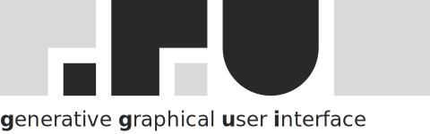

<p align="center">
  <picture>
    <source media="(prefers-color-scheme: dark)" srcset=".github/logo-dark.svg" />
    
  </picture>
</p>

<p align="center"><strong>ggui</strong> is the universal MCP-UI protocol — a runtime-negotiated data contract between AI agents and human users.</p>

<p align="center">
  <a href="https://docs.ggui.ai">Docs</a> ·
  <a href="https://docs.ggui.ai/oss-quickstart/">OSS Quickstart</a>
</p>

> 🚧 **Active development — `v0.1.0-alpha` shipping imminently.** APIs are converging; pin exact versions and watch [Releases](https://github.com/ggui-ai/ggui/releases) for the first alpha tag.

---

Agents describe what they need in natural language; ggui generates ephemeral, interactive interfaces over MCP. No frontend code, no React templates, no custom components — agents talk, users see UI.

This repo is the **open protocol + reference runtime**. Self-host with `ggui serve`; pair against any MCP-aware agent runtime (Claude Desktop, Claude Code, Cursor, ChatGPT desktop, Goose, your own). Zero account required, zero managed infrastructure required, zero cloud dependency.

## Quickstart

```bash
# Run the OSS server directly via the `@ggui-ai/cli` binary
npx @ggui-ai/cli serve     # binds 127.0.0.1:6781 by default

# Or install globally
npm install -g @ggui-ai/cli
ggui serve
```

`ggui serve` stands up `@ggui-ai/mcp-server` with the first-run bundle: MCP at `/mcp`, the same-origin session viewer at `/r/<shortCode>`, pairing endpoints, and a live-channel WebSocket. Open `http://127.0.0.1:6781/` to land on the operator console.

Point any MCP-compatible agent runtime at `http://127.0.0.1:6781/mcp` with `Authorization: Bearer dev`. The [OSS Quickstart](https://docs.ggui.ai/oss-quickstart/) walks through the full self-hosted path including pairing.

### Honest scope today

- ✅ Local server, viewer, cookie-authenticated WebSocket subscribe → ack all work end-to-end.
- ✅ `ggui_push` mints shortCodes and lands on the same-origin viewer.
- ✅ Component-code generation is wired on the OSS path via `createUiGenerator()` from `@ggui-ai/ui-gen` (the same harness the hosted runtime uses). `ggui_push` returns `codeReady: false` only when no BYOK credentials resolve (no `ANTHROPIC_API_KEY` / `OPENAI_API_KEY` / etc.); supply a key to get full generation locally.
- 🔒 Default auth is dev-mode (any non-empty bearer → `builder`). Swap in a real `AuthAdapter` via `createGguiServer({ auth })` before exposing beyond `127.0.0.1`.

## How it works

```
┌─────────┐     MCP Tools      ┌──────────┐     WebSocket     ┌──────────┐
│  Your   │ ────────────────→  │  ggui    │ ────────────────→ │  User's  │
│  Agent  │   ggui_push        │  server  │   real-time UI    │  browser │
│         │   ggui_update      │          │   updates         │          │
│         │ ←────────────────  │          │ ←──────────────── │          │
│         │   user events      │          │   clicks, forms   │          │
└─────────┘                    └──────────┘                   └──────────┘
```

Your agent uses MCP tools to push UIs and receive user events. The protocol is defined by `@ggui-ai/protocol`; the reference server lives in `@ggui-ai/mcp-server`; embedding primitives ship in `@ggui-ai/react`.

### MCP tools (primary surface)

| Tool             | Description                                              |
| ---------------- | -------------------------------------------------------- |
| `ggui_push`      | Push a UI to the user (natural-language prompt + data)   |
| `ggui_update`    | Update props on an existing UI (no regeneration, ~200ms) |
| `ggui_handshake` | Initial session bootstrap                                |

Plus a blueprint family (`ggui_search_blueprints`, `ggui_render_blueprint`, `ggui_list_featured_blueprints`, …) for catalogue lookups. Full reference: [MCP Protocol Reference](https://docs.ggui.ai/api/mcp-protocol/).

### Zero agent code (MCP config only)

If your agent runtime supports MCP natively, skip the SDK entirely. Add `ggui serve` as an MCP server:

```json
{
  "mcpServers": {
    "ggui": {
      "url": "http://127.0.0.1:6781/mcp",
      "headers": { "Authorization": "Bearer dev" }
    }
  }
}
```

The runtime's native tool-calling loop discovers `ggui_push`, `ggui_update`, and the blueprint catalogue tools directly. Working examples per framework: [Claude](https://docs.ggui.ai/examples/claude-agent/), [OpenAI](https://docs.ggui.ai/examples/openai-agent/), [Gemini](https://docs.ggui.ai/examples/gemini-agent/), [generic MCP](https://docs.ggui.ai/examples/generic-mcp/).

## Embedding UIs

`<McpAppIframe>` is the canonical consumer primitive. It takes an MCP Apps resource and mounts the ggui session inside a same-origin iframe. The iframe owns the WebSocket lifecycle, renderer bundle, and stack rendering — host code does not touch `StackItem` / WebSocket / renderer internals.

```tsx
import { McpAppIframe, type ProtocolError } from "@ggui-ai/react";
import { useEffect, useState } from "react";

function App({ sessionId }: { sessionId: string }) {
  const [resource, setResource] = useState<{ uri: string; mimeType: string; text: string } | null>(
    null
  );

  useEffect(() => {
    // Fetch the session-resource envelope from your MCP host. On the
    // OSS path the renderer route at /r/<shortCode> embeds the
    // bootstrap inline, so a resource with just `{ uri }` is enough.
    fetchSessionResource(sessionId).then((r) => setResource(r.contents[0]));
  }, [sessionId]);

  if (!resource) return <p>Loading…</p>;

  return <McpAppIframe resource={resource} onError={(err: ProtocolError) => console.error(err)} />;
}
```

Implementer references for the full protocol: [Architecture overview](https://docs.ggui.ai/architecture/overview/), [MCP Apps support](https://docs.ggui.ai/api/mcp-apps/), [WebSocket protocol](https://docs.ggui.ai/api/websocket-protocol/).

For non-React frameworks, embed the viewer directly:

```html
<iframe src="http://127.0.0.1:6781/r/{shortCode}" width="100%" height="600"></iframe>
```

## Packages

Consumer-facing surface — what you `npm install`:

| Package                                                 | Purpose                                                        | npm                                                                                                           |
| ------------------------------------------------------- | -------------------------------------------------------------- | ------------------------------------------------------------------------------------------------------------- |
| [`@ggui-ai/cli`](./packages/ggui-cli)                   | The `ggui` binary — `ggui serve`, `ggui dev`, `ggui blueprint` | [](https://npmjs.com/package/@ggui-ai/cli)                   |
| [`@ggui-ai/mcp-server`](./packages/mcp-server)          | Reference OSS server (programmatic embedding)                  | [](https://npmjs.com/package/@ggui-ai/mcp-server)     |
| [`@ggui-ai/react`](./packages/ggui-react)               | React embedding — `<McpAppIframe>` + shells                    | [](https://npmjs.com/package/@ggui-ai/react)               |
| [`@ggui-ai/react-native`](./packages/ggui-react-native) | React Native embedding — WebView-backed renderer               | [](https://npmjs.com/package/@ggui-ai/react-native) |
| [`@ggui-ai/protocol`](./packages/protocol)              | Wire types (events, sessions, WebSocket, MCP envelopes)        | [](https://npmjs.com/package/@ggui-ai/protocol)         |
| [`@ggui-ai/gadgets`](./packages/gadgets)                | Author wrappers for 3rd-party libs (Leaflet, Mapbox, …)        | [](https://npmjs.com/package/@ggui-ai/gadgets)           |

Plus ~30 supporting packages under [`packages/`](./packages) spanning the runtime (`@ggui-ai/mcp-server-core`, `@ggui-ai/mcp-server-handlers`, `@ggui-ai/ui-gen`, `@ggui-ai/negotiator`), authoring (`@ggui-ai/project-config`, `@ggui-ai/ui-registry`, `@ggui-ai/predefined`), registry (`@ggui-ai/registry-core`, `@ggui-ai/registry-server`), and dev tooling (`@ggui-ai/dev-stack`, `@ggui-ai/agent-runtime`, `@ggui-ai/console`). See each subdirectory for details.

## Hosted providers

Self-hosting is the primary path. If you'd prefer managed infrastructure (no server to run, no LLM key to wire, hosted dashboards), [Guuey](https://guuey.com) is the first-party hosted provider built on this protocol. The OSS protocol is identical on both paths — you can move between self-hosted and hosted without rewriting anything against this SDK.

## Contributing

See [CONTRIBUTING.md](./CONTRIBUTING.md). Issues + PRs welcome.

## License

Apache 2.0 — see [LICENSE](./LICENSE).
