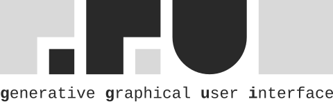

<p align="center">
  <picture>
    <source media="(prefers-color-scheme: dark)" srcset=".github/logo-dark.svg" />
    
  </picture>
</p>

<p align="center"><strong>ggui</strong> is the universal MCP-UI protocol — a runtime-negotiated data contract between AI agents and human users.</p>

<p align="center">
  <a href="https://docs.ggui.ai">Docs</a> ·
  <a href="https://github.com/ggui-ai/ggui/releases">Releases</a>
</p>

> 🚧 **Active development — pre-1.0.** All 32 `@ggui-ai/*` packages ship in lockstep minor waves (currently `0.12.x`); the protocol is a draft and may still change between waves. Pin exact versions (see badges below) and watch [Releases](https://github.com/ggui-ai/ggui/releases) for each wave's notes; `v1.0` marks the protocol freeze.

---

Agents describe what they need in natural language; ggui generates ephemeral, interactive interfaces over MCP. No frontend code, no React templates, no custom components — agents talk, users see UI.

This repo is the **open protocol + reference runtime**. Self-host with `ggui serve`; pair against any MCP-aware agent runtime (Claude Desktop, Claude Code, claude.ai, Cursor, ChatGPT desktop, Goose, your own). Zero account required, zero managed infrastructure required, zero cloud dependency.

---

## Quick start — pick your path

### 1. Composed golden path — platform-composed (guuey-sdk)

One flow from a `guuey.json` to a rendered, interactive todo UI — every piece a published SDK. [guuey](https://guuey.com)'s dev tooling runs the agent (`@guuey/cli` + `@guuey/worker`), the ggui runtime is the dev router's injected MCP default, and the web client talks to the router with `@guuey/agent-client`. This path is **platform-composed**: it drives the ggui protocol through guuey's published SDKs. The protocol itself has no guuey dependency — paths 2–4 run without it, and the framework-native samples (path 2) stay first-class.

Prerequisites: **Node.js 22+**, **pnpm**, and an **`ANTHROPIC_API_KEY`** (one key drives both the agent and ggui's UI generation).

```bash
git clone https://github.com/ggui-ai/ggui && cd ggui
pnpm install                        # workspace deps — `guuey dev` spawns the colocated
                                    # todo MCP from samples/mcp-servers/todo
export ANTHROPIC_API_KEY=sk-ant-…   # in every terminal below

# terminal 1 — the ggui runtime MCP (guuey's dev router injects ggui → this port)
npx -y @ggui-ai/cli serve --mcp-only     # http://127.0.0.1:6781/mcp

# terminal 2 — the agent half: guuey.json + a Claude agent worker
cd samples/agents/with-guuey
npm install
npm run dev                              # guuey dev --serve → http://localhost:6790

# terminal 3 — the web half: chat + rendered ggui cards
cd samples/apps/with-guuey-web
npm install
npm run dev                              # http://127.0.0.1:6890
```

**Browser-based clients.** Pages served from `localhost` reach the MCP
endpoint out of the box. A page on any other origin — a deployed site,
an Electron renderer — must be allowlisted:

```bash
ggui serve --browser-origin https://app.example.com
```

(repeatable; or `GGUI_BROWSER_ORIGINS=a,b`). The allowlist drives both
MCP-wire Origin validation and the CORS response headers, so one flag
covers both. It is not authentication — `/mcp` still requires a bearer.
Non-browser clients (Claude Desktop, agents, curl) are unaffected: they
connect server-to-server and ignore CORS entirely.

Open **`http://127.0.0.1:6890`** and ask for your todos: the agent calls the todo MCP, renders an interactive todo UI through ggui, and your clicks flow back to the agent. Per-sample detail (ports, env vars, known limitations): [`samples/agents/with-guuey`](https://github.com/ggui-ai/ggui/tree/main/samples/agents/with-guuey) · [`samples/apps/with-guuey-web`](https://github.com/ggui-ai/ggui/tree/main/samples/apps/with-guuey-web). Prefer a scaffolded start? `npx @guuey/create-agentic-app` scaffolds a guuey agentic app of the same shape (agent + MCP + ggui + web) in one command.

> **Dev-server trust:** `guuey dev` runs your agent unjailed with your environment — standard dev-server trust; run it in a container if that posture doesn't fit.

### 2. Bring your own framework — build from the framework-native samples

The framework-native path to **ship an agent end-to-end** — no guuey dependency. The canonical samples are complete, runnable pieces of an agentic app — an agent backend per SDK, a stock ggui server config, a reference MCP server, and a web client. Compose them into a workspace and run the whole thing:

```bash
git clone https://github.com/ggui-ai/ggui && cd ggui

# your app = four samples composed into one pnpm workspace:
#   samples/agents/<sdk>/        → servers/agent/     (claude-agent-sdk | openai-agents-sdk | google-adk)
#   samples/gguis/default/       → servers/ggui/      (stock `ggui serve` config)
#   samples/mcp-servers/todo/    → servers/mcps/todo/ (reference domain MCP)
#   samples/apps/ggui-basic-web/ → apps/web/          (Vite + React chat client)
# (e2e/samples-render/app-shell/ is the reference root wrapper — package.json
#  with the dev scripts + pnpm-workspace.yaml + the `pnpm dev` orchestrator.)

pnpm install
# put your LLM API key in .env.local, then:
pnpm dev                     # starts ggui + MCP servers + agent + web, then opens the app
```

`pnpm dev` brings all four services up together and opens **`http://localhost:6890`** once it's ready — so you never have to guess which port to visit (server logs are hidden by default; `pnpm dev --verbose` streams them). The full loop runs locally: you type → the agent calls domain tools and renders a React UI → you click in that UI → the agent reacts. Each sample carries its own README with standalone run instructions.

Building a hosted agent instead? See [guuey.com](https://guuey.com) — the managed platform for running agents (not a drop-in replacement for the samples path).

### 3. Self-host the OSS MCP server + test from claude.ai

For **testing the ggui protocol against a real chat host**. Localhost won't work from claude.ai — you need a public HTTPS URL, which [cloudflared](https://developers.cloudflare.com/cloudflare-one/connections/connect-networks/) provides for free.

```bash
# terminal 1 — boot the OSS MCP server
npm install -g @ggui-ai/cli
ANTHROPIC_API_KEY=sk-… ggui serve --mcp-only       # http://127.0.0.1:6781/mcp

# terminal 2 — expose it to the public internet (no Cloudflare account needed)
cloudflared tunnel --url http://127.0.0.1:6781     # prints https://<random>.trycloudflare.com
```

**Browser-based clients.** Pages served from `localhost` reach the MCP
endpoint out of the box. A page on any other origin — a deployed site,
an Electron renderer — must be allowlisted:

```bash
ggui serve --browser-origin https://app.example.com
```

(repeatable; or `GGUI_BROWSER_ORIGINS=a,b`). The allowlist drives both
MCP-wire Origin validation and the CORS response headers, so one flag
covers both. It is not authentication — `/mcp` still requires a bearer.
Non-browser clients (Claude Desktop, agents, curl) are unaffected: they
connect server-to-server and ignore CORS entirely.

Then in **claude.ai → Settings → Connectors → Add custom connector**, paste `https://<random>.trycloudflare.com/mcp`. Ask Claude to render any UI; the server generates the component and serves it back as a rich rendered card inside the chat.

Install cloudflared via your package manager: `brew install cloudflared` (macOS), `apt install cloudflared` (Debian), or grab a binary from [cloudflare.com/products/tunnel](https://www.cloudflare.com/products/tunnel/).

### 4. Use the hosted ggui cloud — `mcp.ggui.ai`

For **production**, sign in at [the ggui console](https://console.ggui.ai) → create an app → mint a connector key. Paste the bare `https://mcp.ggui.ai` endpoint into your chat host's connector settings — no self-hosting, no tunnel, no key management.

---

## The `ggui` CLI

`@ggui-ai/cli` ships the `ggui` binary — the single entrypoint for every OSS workflow. Five verbs cover the full lifecycle:

| Verb             | What it does                                                                                                                                                                                                       |
| ---------------- | ------------------------------------------------------------------------------------------------------------------------------------------------------------------------------------------------------------------ |
| `ggui serve`     | Boot the OSS MCP server (`/mcp`), session viewer (`/r/<shortCode>`), pairing endpoints, and live-channel WebSocket. `--mcp-only` skips agent supervision — fastest first-run. `--port`, `--host` adjust binding.   |
| `ggui dev`       | Local UI registry + compile-on-demand dev hub for iterating on a `ggui.json` project. Optional tunnel, agent supervision, browser auto-open. Run `ggui --help` for the full flag list.                             |
| `ggui blueprint` | Author + publish + install cached UI templates — `create`, `publish`, `install`. Blueprints make a known screen cheap, repeatable, and visually consistent by matching before falling back to full LLM generation. |
| `ggui gadget`    | Author + publish + install client-side libraries (maps, charts, camera, clipboard, anything) wrapped as ggui hooks/components so the generator can use them — `create`, `publish`, `install`.                      |
| `ggui theme`     | Validate and inspect `ggui.json#theme` DTCG documents — `ggui theme validate <path>`. Catches schema errors before they reach the runtime.                                                                         |

Plus auth verbs for the hosted path: `ggui login` / `ggui logout` / `ggui whoami` / `ggui keys`. Run `ggui --help` for the top-level overview, or `ggui <verb> --help` for per-command flags.

Full CLI reference: [`@ggui-ai/cli` README](./packages/ggui-cli/README.md).

---

## Runnable examples

[`samples/`](https://github.com/ggui-ai/ggui/tree/main/samples) holds end-to-end examples you can clone:

- [`samples/gguis/`](https://github.com/ggui-ai/ggui/tree/main/samples/gguis) — ready-to-run project configs (`default`, `leaflet-demo`, `mapbox-demo`, `canvas-demo`) showing how a `ggui.json` is shaped.
- [`samples/agents/`](https://github.com/ggui-ai/ggui/tree/main/samples/agents) — framework-native reference agents per SDK (Claude Agent SDK, OpenAI Agents SDK, Google ADK) talking to ggui as an MCP server.
- [`samples/agents/with-guuey`](https://github.com/ggui-ai/ggui/tree/main/samples/agents/with-guuey) + [`samples/apps/with-guuey-web`](https://github.com/ggui-ai/ggui/tree/main/samples/apps/with-guuey-web) — the **platform-composed (guuey-sdk)** golden-path pair: a `guuey.json` Claude agent served by `@guuey/cli`'s dev router, and a web client on `@guuey/agent-client` rendering ggui cards (see [path 1](#1-composed-golden-path--platform-composed-guuey-sdk) above).
- [`samples/gadgets/`](https://github.com/ggui-ai/ggui/tree/main/samples/gadgets) — example component / hook gadgets for the marketplace.
- [`samples/mcp-servers/`](https://github.com/ggui-ai/ggui/tree/main/samples/mcp-servers) — minimal domain MCP servers (e.g. a todo server) you can pair against.

### Honest scope today

- ✅ Local server, viewer, cookie-authenticated WebSocket subscribe → ack all work end-to-end.
- ✅ `ggui_render` mints shortCodes and lands on the same-origin viewer.
- ✅ Component-code generation is wired on the OSS path via `createUiGenerator()` from `@ggui-ai/ui-gen` (the same harness the hosted runtime uses). When no BYOK credentials resolve (no `ANTHROPIC_API_KEY` / `OPENAI_API_KEY` / etc.), `ggui_render` returns an `isError: true` tool result whose `structuredContent.error.code` is `NO_CREDENTIALS`; supply a key to get full generation locally.
- 🔒 Default auth is dev-mode (any non-empty bearer → `builder`). Swap in a real `AuthAdapter` via `createGguiServer({ auth })` before exposing beyond `127.0.0.1`.

## How it works

```
┌─────────┐     MCP Tools      ┌──────────┐     WebSocket     ┌──────────┐
│  Your   │ ────────────────→  │  ggui    │ ────────────────→ │  User's  │
│  Agent  │   ggui_render      │  server  │   real-time UI    │  browser │
│         │   ggui_update      │          │   updates         │          │
│         │ ←────────────────  │          │ ←──────────────── │          │
│         │   user events      │          │   clicks, forms   │          │
└─────────┘                    └──────────┘                   └──────────┘
```

Your agent uses MCP tools to push UIs and receive user events. The protocol is defined by `@ggui-ai/protocol`; the reference server lives in `@ggui-ai/mcp-server`; embedding host-helpers ship in `@ggui-ai/mcp-apps-react` (web) and `@ggui-ai/mcp-apps-react-native` (React Native).

### MCP tools (primary surface)

| Tool             | Description                                               |
| ---------------- | --------------------------------------------------------- |
| `ggui_render`    | Render a UI for the user (natural-language prompt + data) |
| `ggui_update`    | Update props on an existing UI (no regeneration, ~200ms)  |
| `ggui_handshake` | Initial session bootstrap                                 |
| `ggui_consume`   | Long-poll for user gestures (clicks, form submits)        |

Plus a blueprint family (`ggui_search_blueprints`, `ggui_render_blueprint`, `ggui_list_featured_blueprints`, …) for catalogue lookups. Full reference: [MCP Protocol Reference](https://docs.ggui.ai/api/mcp-protocol/).

### Zero agent code (MCP config only)

If your agent runtime supports MCP natively, skip the SDK entirely. Add `ggui serve` as an MCP server:

```json
{
  "mcpServers": {
    "ggui": {
      "url": "http://127.0.0.1:6781/mcp",
      "headers": { "Authorization": "Bearer dev" }
    }
  }
}
```

The runtime's native tool-calling loop discovers `ggui_render`, `ggui_update`, `ggui_consume`, and the blueprint catalogue tools directly. Working examples per framework: [Claude](https://docs.ggui.ai/examples/claude-agent/), [OpenAI](https://docs.ggui.ai/examples/openai-agent/), [Gemini](https://docs.ggui.ai/examples/gemini-agent/), [generic MCP](https://docs.ggui.ai/examples/generic-mcp/).

## Embedding UIs

On web, `<AppRenderer>` — imported directly from `@mcp-ui/client`, the spec-canonical MCP Apps host — is the canonical consumer primitive, driven by ggui's `useMcpAppsChat` hook from `@ggui-ai/mcp-apps-react`. `<AppRenderer>` mounts each ggui render inside a sandboxed iframe; the iframe owns the WebSocket lifecycle and renderer bundle, so host code never touches render internals or WebSocket machinery directly.

```bash
npm install @ggui-ai/mcp-apps-react @mcp-ui/client
```

```tsx
import { AppRenderer } from "@mcp-ui/client";
import { useMcpAppsChat } from "@ggui-ai/mcp-apps-react/chat-helpers";

function Chat({ agentUrl, sandboxUrl }: { agentUrl: string; sandboxUrl: string }) {
  const { sessions, send, handleAppMessage } = useMcpAppsChat({
    chatEndpoint: `${agentUrl}/agent`,
  });

  // render `entries` as chat bubbles; call send(prompt) to talk to the agent.
  // onReadResource / onCallTool relay through your agent backend — see the
  // full runnable reference below for the wiring.
  const latest = sessions[sessions.length - 1];
  return latest ? (
    <AppRenderer
      toolName="ggui_render"
      sandbox={{ url: new URL(sandboxUrl) }}
      html={latest.inlinedResource?.text}
      onMessage={handleAppMessage}
      onError={(err) => console.warn("render error", err)}
    />
  ) : null;
}
```

The complete runnable reference — including auth, sandbox relay, and tool-call wiring — is the [`ggui-basic-web`](https://github.com/ggui-ai/ggui/tree/main/samples/apps/ggui-basic-web) sample. **Start there.**

React Native's equivalent host is `<McpAppIframe>` from `@ggui-ai/mcp-apps-react-native` — RN-only; there is no `<McpAppIframe>` on web.

Implementer references for the full protocol: [React host helpers](https://docs.ggui.ai/sdk/react/), [Architecture overview](https://docs.ggui.ai/architecture/overview/), [MCP Apps support](https://docs.ggui.ai/api/mcp-apps/), [WebSocket protocol](https://docs.ggui.ai/api/websocket-protocol/).

For non-React frameworks, embed the viewer directly:

```html
<iframe src="http://127.0.0.1:6781/r/{shortCode}" width="100%" height="600"></iframe>
```

## Packages

Consumer-facing surface — what you `npm install`:

| Package                                                              | Purpose                                                             | npm                                                                                                                             |
| -------------------------------------------------------------------- | ------------------------------------------------------------------- | ------------------------------------------------------------------------------------------------------------------------------- |
| [`@ggui-ai/cli`](./packages/ggui-cli)                                | The `ggui` binary — `serve`, `dev`, `blueprint`, `gadget`, `theme`  | [](https://npmjs.com/package/@ggui-ai/cli)                                     |
| [`@ggui-ai/mcp-server`](./packages/mcp-server)                       | Reference OSS server (programmatic embedding)                       | [](https://npmjs.com/package/@ggui-ai/mcp-server)                       |
| [`@ggui-ai/mcp-apps-react`](./packages/mcp-apps-react)               | React web host helpers — `useMcpAppsChat` + MCP-Apps chat hook      | [](https://npmjs.com/package/@ggui-ai/mcp-apps-react)               |
| [`@ggui-ai/mcp-apps-react-native`](./packages/mcp-apps-react-native) | React Native host helpers — `<McpAppIframe>` MCP-Apps host + shells | [](https://npmjs.com/package/@ggui-ai/mcp-apps-react-native) |
| [`@ggui-ai/protocol`](./packages/protocol)                           | Wire types (events, sessions, WebSocket, MCP envelopes)             | [](https://npmjs.com/package/@ggui-ai/protocol)                           |
| [`@ggui-ai/gadgets`](./packages/gadgets)                             | Author wrappers for 3rd-party libs (Leaflet, Mapbox, …)             | [](https://npmjs.com/package/@ggui-ai/gadgets)                             |

Plus 27 supporting packages under [`packages/`](./packages) spanning the runtime (`@ggui-ai/mcp-server-core`, `@ggui-ai/mcp-server-handlers`, `@ggui-ai/ui-gen`, `@ggui-ai/negotiator`), authoring (`@ggui-ai/project-config`, `@ggui-ai/ui-registry`), registry (`@ggui-ai/registry-core`, `@ggui-ai/registry-server`), and dev tooling (`@ggui-ai/dev-stack`, `@ggui-ai/agent-runtime`, `@ggui-ai/console`). See each subdirectory for details.

## Hosted providers

Self-hosting is the primary path. For managed infrastructure (no server to run, no LLM key to wire, hosted dashboards), the first-party hosted endpoint at **`mcp.ggui.ai`** is live — see [path 4](#4-use-the-hosted-ggui-cloud--mcpgguiai) above. [Guuey](https://guuey.com) hosts an upgraded experience built on top of the protocol. The protocol is identical on all paths — you can move between self-hosted and hosted without rewriting anything against this SDK.

## Contributing

See [CONTRIBUTING.md](./CONTRIBUTING.md). Issues + PRs welcome.

## License

Apache 2.0 — see [LICENSE](./LICENSE).
